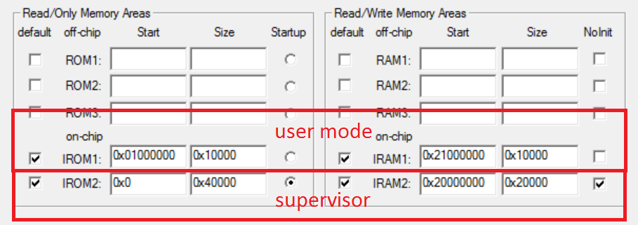
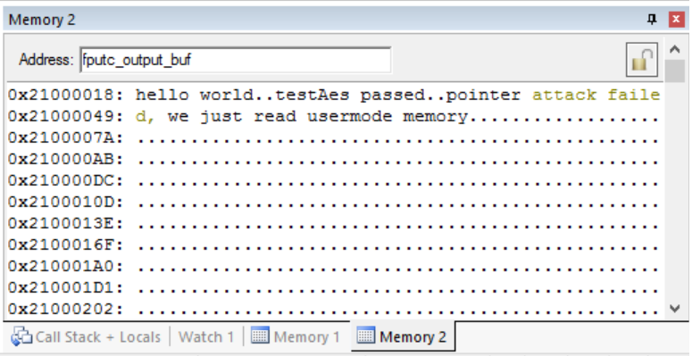

# cm0-supervisor-demo
This repository contains a Keil microvision multi-project file. It contains two projects:
* supervisor
* usermode

Both projects are targeting a generic ARM-Cortex-M0+ MCU and are meant to work together.

The supervisor, as implied by its name, is in control of the MCU. It executes always in privileged mode and controls the boot as well as the MPU. 
After few initializations it launches the usermode code which runs in unprivileged mode. The supervisor project expose few services to the usermode project:
* encryption/decryption with a secret key "key1"
* decryption only with a secret key "key2"

Those services are implemented by software, the point of using the supervisor here is to protect the secret keys from any malware executing in usermode.
The services are exposed via the SVC mechanism, a typical "software interrupt" scheme that has equivalents on many other CPU architectures.
The memory map has been set such that address bit 24 is always 1 in user mode memory areas. The could could work without this but that allows a simple way to check or enforce that a pointer really points to user mode area.

The usermode project is setup in such a way that the supervisor image is loaded in memory before the ISS starts. As a result, when you start debugging this project the boot code which is executed is actually the supervisor startup. After some initialization, the code jumps to "Boot_Base_Address" (defined in supervisor's startup.s), executing in unprivileged mode. There the startup of the usermode project is executed and finally call usermode's main function.
The main function test the services exposed by the supervisor project and then try to attack it in various ways to gain privileged execution. At some point an abuse ends up triggering an hard fault and the execution is stuck in an infinite loop in supervisor's "hard fault" handler.
At the end, you should be able to see the following output:

The challenge is to modify the usermode code to get knowledge of the secret keys.